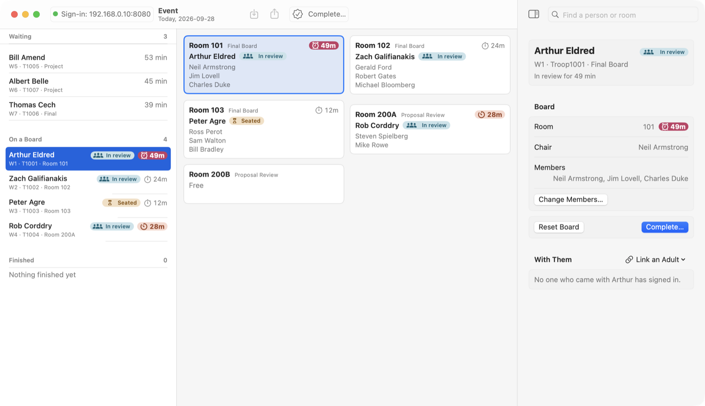
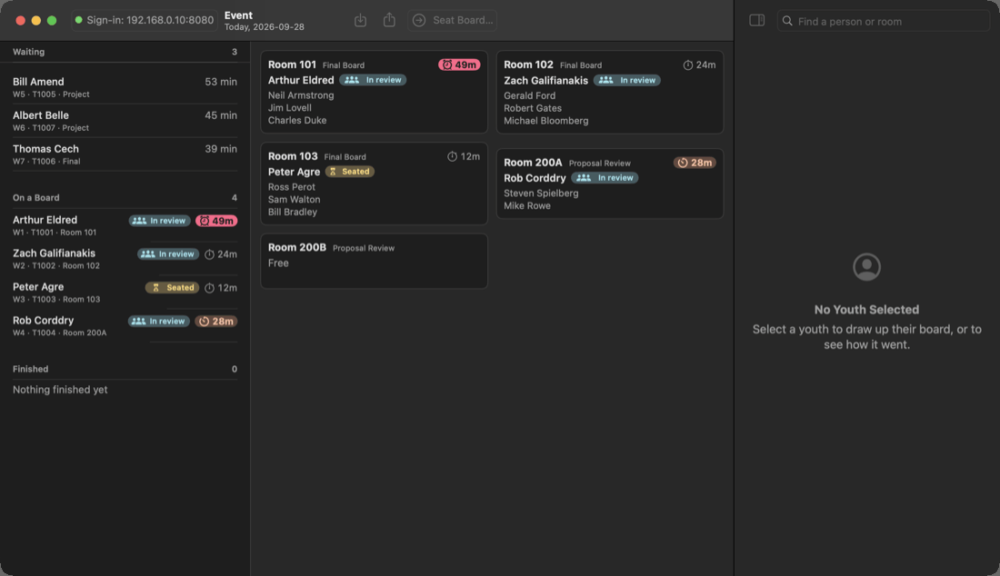
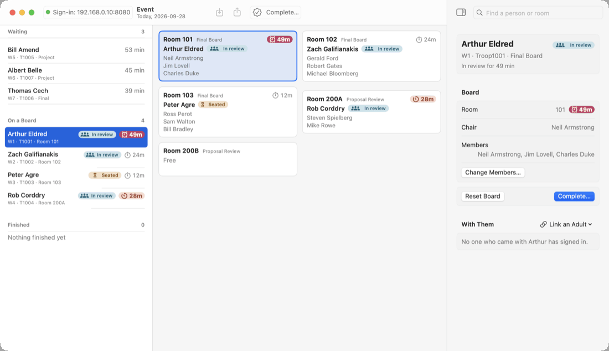

# Eagle Boards

A Mac app for the check-in desk and room assignments on an Eagle Scout board
of review event. Youth and adults sign themselves in on a tablet at the door,
using its web browser. You sit at the Mac, put each youth with a board and a
room, and record the result when they come out.

It runs on one Mac at the event. It needs no internet, only a Wi-Fi network
that the tablet and the Mac are both on.

This is the native Mac version of the Java
[Eagle Board Scheduler](https://github.com/deekayen/eagleboards-java). It reads and
writes the same data files, so a district can switch between them.

<picture>
  <source media="(prefers-color-scheme: dark)" srcset="docs/images/event-dark.png">
  
</picture>

**Running an event? This page is the whole manual.** The same guide is
in the app under **Help › Eagle Boards Help**. The pictures use a made-up
event whose cast is famous Eagle Scouts; nothing in them is real.

## Before the first event

You need three things:

1. **A Mac with Apple silicon** (M1 or later) running macOS 14 Sonoma or
   later, with Eagle Boards on it. Intel Macs are not supported.
2. **A tablet or laptop for the door**, with a web browser, on the same Wi-Fi.
3. **Your room list**: which rooms you have, and whether each is used for
   project proposal reviews or for final boards.

The first time Eagle Boards opens, it asks where to keep its data. Choose
**Use Documents › Eagle Boards**, or a folder of your own. If you used the
Java Eagle Board Scheduler, choose the folder it ran in, the one holding
`Master_AdultHistory.csv` and the dated folders. Both programs read the same
files.

That folder holds personal information, some of it about minors. Keep it
private.

## Starting up

Open Eagle Boards. It opens today's event and starts the sign-in station at once.

If macOS asks whether Eagle Boards may accept incoming network connections,
click **Allow**. Otherwise the tablet cannot reach it.

Click the green **Sign-in** address at the top left of the window. Scan the QR
code with the tablet's camera, or type the address into the tablet's browser.
For a second display or a projector, **Window › Sign-In Code** shows the code
as large as the window.

Only the sign-in pages are on the network. The scheduler, the records and the
settings stay on the Mac, so nobody at the door can look up anyone's details.

## Set up your rooms

Do this before anyone arrives. A board cannot be seated without a room.

Choose **Room › Add Room…** (**⇧⌘N**) and add each room, marking it **Final
Board** or **Proposal Review** by what it is used for today. After the first
event, **Room › Copy Rooms From** brings back an earlier event's list.

To hold two proposal reviews in one room, add it twice, e.g. `200A` and `200B`.

Right-click a room card to rename it, move its board to another room, or
change what it is used for.

## The event, step by step

### 1. People sign in

At the tablet, a youth taps **I am a youth** and an adult taps **I am 21 or
older**. Each fills in the form. Youth who pre-registered on SignUpGenius, and
adults who have served before, are recognized by email, and the rest of the
form fills itself in. A youth is never asked for a phone number or a
birthdate.

Each person appears on the Mac the moment they register. Youth are numbered
`P1, P2…` if they pre-registered and `W1, W2…` if they walked in. Pre-registered
youth are listed ahead of walk-ins.

An adult who would rather not use the tablet can be signed in on the Mac:
choose **Adult › Add Adult…**, or click **Add Adult** at the foot of the
**Adults** page. Search the adult history to fill the form in for someone who
has served before. On the **Adult History CSV** page, double-click someone to sign
them in for today.

### 2. Check the paperwork

Check each youth's paperwork as they sign in. If it is not in order, select
them and choose **Board › Postpone**. **Edit › Undo** brings them back.

### 3. Seat a board

The **View** menu chooses the page; there is no sidebar. **Event** (**⌥⌘1**)
is where you work: every youth in one list, stacked **Waiting** (in sign-in
order), **On a Board** (by room) and **Finished** (the most recent first), each
with its count, and a card for every room filling the rest of the window, so a
room's timer is never out of sight. Drag the line between them to widen the
list. The inspector on the right follows the selected youth on every page.

**Find a person's room.** Type part of anyone's name, youth or adult, in the
search at the top right. The room cards narrow to the rooms holding a match, or
a room by that name, and a line above them says where anyone found in no room
is (*is waiting*, *isn't on a board*, *has gone home*, *has finished*, *was
postponed*). **Return** opens the first room found, or the youth. The other pages are the event's
records (see [The records](#the-records)).

Select a waiting youth. Eagle Boards proposes a board in the inspector: a
chair, enough members, and a free room of the right kind. It never picks adults
from the youth's own unit.

Change the board in the inspector: click an adult in the free list below it
to add them (**Find an adult** narrows the list), and **−** takes one off. In
the **Adults** page you can also Command-click several adults and choose
**Adult › Add to Board** (**⌘B**), or drag them onto the board. A board you
have changed is kept while you look at other youth. **Fill the Rest** keeps
who you chose and adds a chair, if none of them can chair it, and members up to
the number needed; **Suggest a Board** replaces the whole board with a
proposal.

To pick every board yourself, set **Settings › General › When you select a
waiting youth** to **Start with an empty board**. Selecting a youth then picks
only a free room.

Press **Seat Board…** (or **⌘↩**, or double-click the youth). You can also drag
a waiting youth onto a free room card. The sheet lists anything that stops the board, such as
too few members, no qualified chair, or someone already on another board. It
also lists anything worth a second look, and each of those needs its own tick.
Choose the chair and press **Seat Board**.

The members now have the room and the paperwork. The youth waits outside.

### 4. Start the review

When the members have finished reading, select the youth and press **Start
Review** (**⌘↩** again). The confirmation lists who came with the youth, and
their leader and parents if they signed in, so they can be fetched too. The
inspector lists them throughout the event under **With Them**.

### 5. Complete

If someone has to leave mid-board, select the youth and press **Change
Members…** in the inspector. It adds or removes members, or hands the chair to
another member qualified to chair, under the same rules as seating. The room's
timer keeps running; it does not restart.

When the board has finished, press **Complete…** (**⌘↩**), choose the result,
and add any notes. The room and the members are free for the next board.

## Rules the scheduler keeps

- **Board size.** A final board of review has three to six members (Guide to
  Advancement 8.0.0.3). Three is the norm, four to six asks you to confirm, and
  seven is refused. A project proposal review has two to six.
- **The chair.** Only an adult whose role for that kind of board is **Chair**
  may chair it. When the qualified chairs are all busy, promote someone on the
  **Adults** page. Nobody is made chair by accident.
- **One board at a time.** An adult on a board cannot be put on another.
  **Disable** takes someone out of the pool for the event, for example when
  they have gone home. **Enable** brings them back.
- **Same unit.** This council does not allow adults from the youth's own unit
  on the board. You may override that, but a board must still have at least one
  member from outside the unit (8.0.3.0).

## The records

The rest of the **View** menu is a page for each table the event keeps, and
their values are changed in place: click a name, unit or note to type in it,
or click a value with ⌃⌄ beside it to choose from a menu. A change is saved
when you press Return or leave the cell. It is not on **Edit › Undo**, which is
for the Event page's steps; change the cell back instead. Who sits on a board
and which room someone is in are never typed in: they change on the Event
page. Nor is a youth's status: it is read-only on every page, and changes only
through the Event page's steps (**Seat Board**, **Start Review**, **Complete…**,
**Postpone**, **Reset Board** and **Undo**), which take and free a room and its
members. There is no separate records window.

| Page | What it holds |
| --- | --- |
| **Results** (⌥⌘2) | Every board and its result. Correct a result or its notes here. Double-click a board to see it on the Event page. |
| **Adults** (⌥⌘3) | Tonight's adults. Promote someone to Chair, mark Wood Badge, or fix a name; a change to a name, unit, contact or role reaches the adult history too. **Add Adult** at the foot signs someone in by hand. |
| **Youth** (⌥⌘4) | Every youth who signed in, in sign-in order. |
| **Pre-Registered** (⌥⌘5) | The youth who signed up on SignUpGenius for today. |
| **Adult History CSV** (⌥⌘6) | Every adult who has ever signed in, across events, read-only, searched by name, email or unit. **Last Event** has a check for those signed in today; double-click someone to sign them in. |
| **Rooms** (⌥⌘7) | What each room is used for today, and whose board is in it. **Add Room** at the foot adds one. |
| **Approved Proposals** (⌥⌘8) | Every project proposal approved at an earlier event in the data folder, however long ago, for a youth who comes without the signed page: who, their unit, when, the chair and the other members. Read only. |

Right-click a record to delete it; that asks first. **File › Export List…**
(⇧⌘E) saves the page's list as a spreadsheet.

## Room timers

Each busy room shows the minutes since its last step, with a stopwatch. While
a board convenes, it goes overdue after 30 minutes. Once the review starts, a
final board runs long at 30 minutes and is overdue at 45. A proposal review
runs long at 25 and is overdue at 40. Running long is a timer on an orange tint;
overdue is an alarm clock on a solid pink-red fill, so the two differ in shape
and lightness and read with color blindness. They are prompts, not limits.
Change them in **Settings › Timers**.

## SignUpGenius

Put the district's SignUpGenius API key in **Settings › SignUpGenius**.
Eagle Boards keeps it in your macOS keychain. When today's event opens, it imports
the sign-up: youth become pre-registrations and adults join the history. Use
**File › Import Sign-Ups** to do it again.

## After the event

**File › Export Board Results** saves every board and its result as a
spreadsheet (CSV).
Everything is saved as it happens; there is nothing to save before quitting.

Made a mistake? **Edit › Undo** takes back the last step, whether seating,
starting, completing, postponing or resetting a board, changing its members,
disabling an adult, or a change to the rooms from the Event page. It is refused
once the room or a member has been given to another board.

The Dock icon shows how many youth are waiting, and a notification tells you
when a room goes overdue while you are in another app.

## If something goes wrong

| Problem | What to do |
| --- | --- |
| The tablet cannot open the address | Check both are on the same Wi-Fi. Click the sign-in address and try another address listed there. Check that Eagle Boards is allowed in System Settings › Network › Firewall. |
| "Port 8080 is already in use" | Quit the other program (the Java Eagle Board Scheduler uses 8080 too), or change the port in Settings › General. |
| "Not qualified to chair" | Promote someone: on the **Adults** page, click their Final or Project role and choose **Chair**. |
| A board was seated by mistake | Select the youth and choose **Board › Reset Board**, or **Edit › Undo** right after seating. |

## Donating

Eagle Boards is free. If it helps your board events, **Help › Donate…** lists
ways to support its development, with a Venmo QR code a phone can scan.

## For developers

See [CONTRIBUTING.md](CONTRIBUTING.md) for building, testing and the rules
this code keeps. [PROVENANCE.md](PROVENANCE.md) records where it came from.
Licensed under the Apache License 2.0; see [LICENSE](LICENSE) and
[NOTICE](NOTICE).
